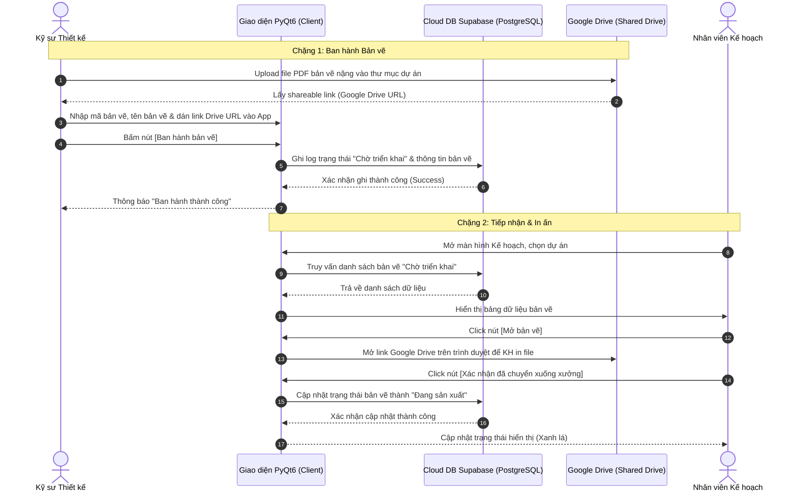

<!--
File: docs/architecture/ARCHITECTURE_MAP.md
CHỨC NĂNG: Bản đồ master kiến trúc kỹ thuật dự án ERP Thiết kế - Kế hoạch (TLS)
CHANGELOG:
- 17:55:00 10/07/2026: [REFACTOR] Modular hóa UI MainWindow thành SidebarWidget & HeaderWidget, tạo BaseDrawingView dùng chung cho ThietKeView/KeHoachView và áp dụng TLSTheme (Lê Thanh Vân/Antigravity)
- 16:30:00 10/07/2026: [UPDATE] Tái cấu trúc UI màn hình Quản lý Dự án xếp lớp dọc, tách project_dialog.py và nút tạo Sidebar (Lê Thanh Vân/Antigravity)
- 15:20:00 10/07/2026: [UPDATE] Bổ sung trường designer_email vào model ProjectSection và script migrate_section_roles.py (Lê Thanh Vân/Antigravity)
- 15:15:00 10/07/2026: [REFACTOR] Module hóa DuAnView thành các component con ProjectWidget và SectionWidget (Lê Thanh Vân/Antigravity)
- 15:08:00 10/07/2026: [UPDATE] Bổ sung cấu trúc vai trò Sales & Thiết kế của dự án và script migrate_project_roles.py (Lê Thanh Vân/Antigravity)
- 12:50:00 10/07/2026: [UPDATE] Bổ sung cấu trúc session_manager.py quản lý tự động đăng nhập (Lê Thanh Vân/Antigravity)
- 17:22:00 08/07/2026: [UPDATE] Cập nhật hoàn thành Giai đoạn 1.6 Đóng gói ứng dụng và tích hợp workflow /build-exe (Lê Thanh Vân/Antigravity)
- 14:35:00 08/07/2026: [UPDATE] Tích hợp cấu trúc mô-đun Google Login (auth_service.py, login_window.py) (Lê Thanh Vân/Antigravity)
- 10:40:00 02/07/2026: [NEW] Khởi tạo bản đồ kiến trúc cho dự án mới (Lê Thanh Vân/Antigravity)
- 11:32:00 02/07/2026: [UPDATE] Bổ sung module ui/common/workers.py cho kiến trúc đa luồng bất đồng bộ (Lê Thanh Vân/Antigravity)
-->

# 🛡️ BẢN ĐỒ KIẾN TRÚC MASTER: ERP TK-KH (TUẤN LONG STEEL)

> **Mã dự án**: 55_ERP_TK_KH_01726
> **Ngôn ngữ**: Python 3.12+ | **Framework UI**: PyQt6 | **Database**: PostgreSQL (Cloud Supabase)
> **Kiến trúc**: Separation of Concerns (Phân tách Trách nhiệm - UI tách biệt Core Logic - Hỗ trợ Multi-threading)

---

## 📂 1. CẤU TRÚC THƯ MỤC DỰ ÁN (Project Structure)

Để đảm bảo dự án phát triển bền vững, không bị phình to code và dễ bảo trì, cấu trúc thư mục được thiết kế chuẩn mực như sau:

```
55_ERP_TK_KH_01726/
│
├── main.py                  # Điểm chạy chính của ứng dụng PyQt6 (khởi động qua LoginWindow)
├── config.py                # Cấu hình kết nối DB, Google OAuth, email phòng ban
├── .gitignore               # Cấu hình bỏ qua các file rác, file tạm
│
├── core/                    # TẦNG CORE LOGIC & DATABASE (Tuyệt đối cấm import PyQt6 tại đây)
│   ├── __init__.py
│   ├── database.py          # Thiết lập kết nối PostgreSQL qua SQLAlchemy
│   ├── models.py            # Định nghĩa các bảng (Projects, Drawings, logs, BOM)
│   └── services/            # Chứa các lớp xử lý nghiệp vụ chính
│       ├── __init__.py
│       ├── auth_service.py    # Xử lý Google OAuth2, chạy Local HTTP Server callback & Mock Login
│       ├── session_manager.py # Quản lý phiên đăng nhập (Session) của người dùng cục bộ
│       ├── project_service.py # Logic nghiệp vụ Quản lý Dự án
│       └── drawing_service.py # Logic nghiệp vụ Ban hành, Cập nhật trạng thái bản vẽ
│
├── ui/                      # TẦNG GIAO DIỆN (PyQt6 - Chỉ xử lý hiển thị, cấm truy vấn DB trực tiếp)
│   ├── __init__.py
│   ├── login_window.py      # Màn hình đăng nhập Google Premium Dark Slate Style
│   ├── main_window.py       # Khung giao diện chính (Sidebar, Header phân quyền, Content Area)
│   ├── sidebar.py           # Widget Sidebar quản lý chọn/tạo/xóa dự án cục bộ
│   ├── header.py            # Widget Header quản lý dự án hiện hành, điều chuyển tab, thông tin user
│   ├── styles/              # Design System QSS dùng chung cho toàn bộ app
│   │   ├── __init__.py
│   │   └── theme.py         # Chứa mã màu tokens và bộ tạo style QSS thống nhất
│   ├── common/              # Các Widget dùng chung (nút bấm, bảng hiển thị, styles...)
│   │   ├── __init__.py
│   │   ├── workers.py       # Luồng phụ xử lý bất đồng bộ (QThread Workers)
│   │   └── base_drawing_view.py # Class cha chứa logic tải và quản lý bảng bản vẽ dùng chung
│   └── views/               # Giao diện của từng phòng ban
│       ├── __init__.py
│       ├── du_an_view.py    # Màn hình quản lý dự án (Container ghép nối)
│       ├── du_an/           # Thư mục chứa các module con quản lý dự án
│       │   ├── project_widget.py # Widget quản lý thông tin dự án hiện hành dạng hàng ngang
│       │   ├── project_dialog.py # Hộp thoại popup nhập liệu tạo mới dự án
│       │   └── section_widget.py # Widget quản lý hạng mục dự án
│       ├── thiet_ke_view.py # Màn hình ban hành bản vẽ (Thiết kế)
│       └── ke_hoach_view.py # Màn hình tiếp nhận, in ấn bản vẽ (Kế hoạch)
│
├── docs/                    # TÀI LIỆU DỰ ÁN
│   └── architecture/
│       ├── ARCHITECTURE_MAP.md # File này (Bản đồ Master)
│       └── MAP_GRAPH.md        # Đồ thị liên kết codebase
│
├── scripts/                 # CÔNG CỤ ĐẢM BẢO CHẤT LƯỢNG & MIGRATION (Audit, Linter, Git Guard, migrate_project_roles.py, migrate_section_roles.py)
└── .agents/                 # AI ASSISTANT RULES & WORKFLOWS
```

---

## 🔄 2. LUỒNG DỮ LIỆU GIAI ĐOẠN 1 (Data Flow)

Giai đoạn 1 tập trung thông suốt luồng công việc giữa phòng **Thiết kế** (Ban hành bản vẽ) và phòng **Kế hoạch** (Tiếp nhận & In ấn) thông qua **Supabase Cloud DB** (lưu trạng thái) và **Google Drive** (lưu file PDF nặng).



---

## 📏 3. RÀNG BUỘC CHẤT LƯỢNG CODE CỨNG (Strict Limits)

Để đảm bảo hệ thống không bị phình to và luôn sạch đẹp, mọi chỉnh sửa mã nguồn bắt buộc phải vượt qua các ngưỡng kiểm soát chất lượng cục bộ của `scripts/audit_code_quality.py`:

1. **Độ dài tệp tin (File Length)**: Tối đa **800 dòng** (Hard Limit). Lên kế hoạch chia nhỏ ở **500 dòng** (Soft Limit).
2. **Độ dài hàm (Function Length)**: Tối đa **100 dòng** (Hard Limit). Khuyến nghị dưới **50 dòng** (Soft Limit).
3. **Số lượng đối số (Arguments)**: Tối đa **4 đối số** thực tế trong một hàm (không tính `self`, `cls`). Nếu nhiều hơn, bắt buộc gom thành Dictionary hoặc Data Class.
4. **Type Hints**: Khai báo đầy đủ 100% cho mọi đối số và giá trị trả về thực tế của hàm (ngoại trừ hàm khởi tạo `__init__` trả về `None`).
5. **Docstrings**: Sử dụng Google-Style docstring đầy đủ cho các hàm và class mới.
6. **Xử lý ngoại lệ**: Tuyệt đối cấm nuốt lỗi im lặng (`except: pass`). Mọi exception bắt buộc phải ghi nhận qua `logger.error` hoặc được re-raise.

---

## 📈 4. KẾ HOẠCH TRIỂN KHAI PHẦN MỀM (Roadmap)

- [x] **Giai đoạn 1.1**: Khởi tạo database trên Supabase & Thiết lập Model SQLAlchemy (`core/models.py`).
- [x] **Giai đoạn 1.2**: Viết tầng Core Logic (`core/services/`): Project & Drawing Services.
- [x] **Giai đoạn 1.3**: Dựng bộ khung giao diện PyQt6 (`ui/main_window.py`).
- [x] **Giai đoạn 1.4**: Hoàn thiện màn hình Thiết kế (`ui/views/thiet_ke_view.py`).
- [x] **Giai đoạn 1.5**: Hoàn thiện màn hình Kế hoạch (`ui/views/ke_hoach_view.py`).
- [x] **Giai đoạn 1.6**: Đóng gói ứng dụng thành file `.exe` chạy độc lập và bàn giao.
