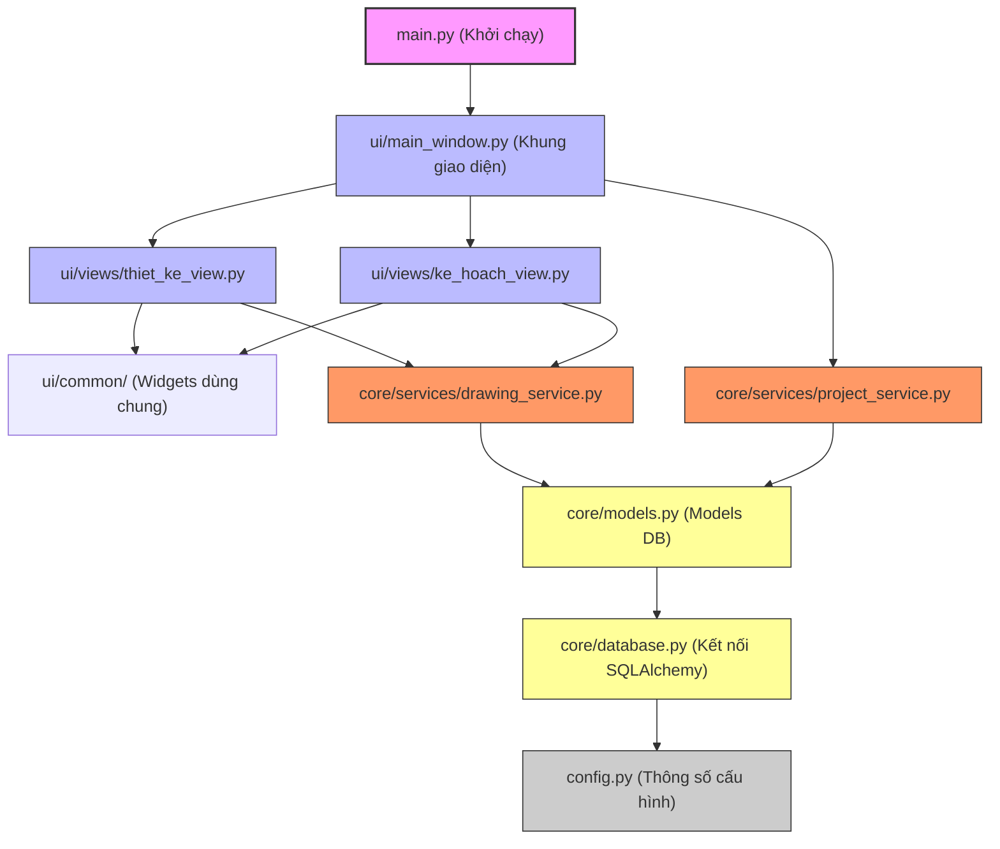

<!--
File: docs/architecture/MAP_GRAPH.md
CHỨC NĂNG: Sơ đồ liên kết codebase và đồ thị phụ thuộc của dự án (ERP TK-KH)
CHANGELOG:
- 10:42:00 02/07/2026: [NEW] Khởi tạo sơ đồ liên kết codebase (Lê Thanh Vân/Antigravity)
-->

# 🌐 ĐỒ THỊ LIÊN KẾT CODEBASE & PHÂN TÍCH TÁC ĐỘNG

> **Dự án**: 55_ERP_TK_KH_01726
> **Nguyên tắc**: Đảm bảo Loose Coupling (Liên kết lỏng). UI không import DB, DB không phụ thuộc UI.

---

## 🗺️ 1. SƠ ĐỒ PHỤ THUỘC TỔNG THỂ (Dependency Graph)

Dưới đây là sơ đồ mối quan hệ nhập khẩu (Import Hierarchy) giữa các module trong hệ thống. Chiều mũi tên `A --> B` nghĩa là **A import B** để sử dụng.

---

## 🔍 2. BẢN ĐỒ PHÂN TÍCH TÁC ĐỘNG (Impact Analysis Guide)

Khi sửa đổi một thành phần trong hệ thống, hãy đối soát bảng sau để kiểm tra các vùng có khả năng bị ảnh hưởng (Side Effects):

| Thành phần bị thay đổi | Vùng bị ảnh hưởng trực tiếp | Hành động bắt buộc |
| --- | --- | --- |
| **`config.py`** | Toàn bộ ứng dụng (Kết nối DB, API) | Chạy kiểm tra kết nối ngay lập tức |
| **`core/database.py`** | `core/models.py`, các Services | Chạy test suite của DB |
| **`core/models.py`** | Các Services, Database Schema | Thực hiện di chuyển DB (Migration) |
| **`core/services/*`** | Các PyQt Views tương ứng | Chạy unit test logic nghiệp vụ |
| **`ui/common/*`** | Toàn bộ giao diện PyQt6 | Mở app trực quan để test UI render |

---

*Đồ thị này sẽ được cập nhật tự động bằng lệnh `python scripts/generate_codebase_graph.py --scan` sau mỗi phiên làm việc.*
