<!--
File: docs/architecture/MAP_GRAPH.md
Description: 🌐 ĐỒ THỊ LIÊN KẾT CODEBASE ERP
CHANGELOG:
- 18:00:00 28/05/2026: [UPDATE] Tối ưu hóa quét Incremental Cache (Lê Thanh Vân)
-->

# 🌐 ĐỒ THỊ LIÊN KẾT CODEBASE ERP TUẤN LONG STEEL

> [!TIP]
> Tài liệu này được tự động cập nhật bằng cơ chế **Incremental Cache** siêu tốc.
> Giúp hình dung rõ ràng mối liên kết gọi hàm và kế thừa trong hệ thống ERP.

---

## 💾 1. Đồ thị liên kết Core & Services (Database, Auth, Project, Drawing, BOQ)

```mermaid
graph TD
    classDef file fill:#f9f,stroke:#333,stroke-width:1px;
    classDef cls fill:#bbf,stroke:#333,stroke-width:1px;
    classDef func fill:#bfb,stroke:#333,stroke-width:1px;
    core_services_auth_service["📄 auth_service.py"]:::file
    core_services_auth_service_OAuthCallbackHandler["🧩 OAuthCallbackHandler"]:::cls
    core_services_auth_service_GoogleAuthServer["🧩 GoogleAuthServer"]:::cls
    core_services_auth_service_GoogleAuthManager["🧩 GoogleAuthManager"]:::cls
    core_services_auth_service_OAuthCallbackHandler_log_message["⚙️ log_message()"]:::func
    core_services_auth_service_OAuthCallbackHandler_do_GET["⚙️ do_GET()"]:::func
    core_services_auth_service_OAuthCallbackHandler__serve_mock_login_page["⚙️ _serve_mock_login_page()"]:::func
    core_services_auth_service_OAuthCallbackHandler__handle_callback["⚙️ _handle_callback()"]:::func
    core_services_auth_service_OAuthCallbackHandler__exchange_code_for_email["⚙️ _exchange_code_for_email()"]:::func
    core_services_auth_service_OAuthCallbackHandler__send_html_response["⚙️ _send_html_response()"]:::func
    core_services_auth_service_GoogleAuthServer___init__["⚙️ __init__()"]:::func
    core_services_auth_service_GoogleAuthManager___init__["⚙️ __init__()"]:::func
    core_services_auth_service_GoogleAuthManager_start_server["⚙️ start_server()"]:::func
    core_services_auth_service_GoogleAuthManager__run_server["⚙️ _run_server()"]:::func
    core_services_auth_service_GoogleAuthManager_get_auth_url["⚙️ get_auth_url()"]:::func
    core_services_auth_service_GoogleAuthManager_get_authenticated_email["⚙️ get_authenticated_email()"]:::func
    core_services_auth_service_GoogleAuthManager_shutdown["⚙️ shutdown()"]:::func
    core_services_auth_service_GoogleAuthManager__async_close["⚙️ _async_close()"]:::func
    core_services_drawing_service["📄 drawing_service.py"]:::file
    core_services_drawing_service_create_drawing["⚙️ create_drawing()"]:::func
    core_services_drawing_service_update_drawing_status["⚙️ update_drawing_status()"]:::func
    core_services_drawing_service_get_project_drawings["⚙️ get_project_drawings()"]:::func
    core_services_project_service["📄 project_service.py"]:::file
    core_services_project_service_create_project["⚙️ create_project()"]:::func
    core_services_project_service_get_project["⚙️ get_project()"]:::func
    core_services_project_service_list_active_projects["⚙️ list_active_projects()"]:::func
    core_services_project_service_update_project_status["⚙️ update_project_status()"]:::func
    core_services___init__["📄 __init__.py"]:::file
    core_services_auth_service -->|contains| core_services_auth_service_OAuthCallbackHandler
    core_services_auth_service -->|contains| core_services_auth_service_GoogleAuthServer
    core_services_auth_service -->|contains| core_services_auth_service_GoogleAuthManager
    core_services_auth_service_OAuthCallbackHandler -->|contains| core_services_auth_service_OAuthCallbackHandler_log_message
    core_services_auth_service_OAuthCallbackHandler -->|contains| core_services_auth_service_OAuthCallbackHandler_do_GET
    core_services_auth_service_OAuthCallbackHandler -->|contains| core_services_auth_service_OAuthCallbackHandler__serve_mock_login_page
    core_services_auth_service_OAuthCallbackHandler -->|contains| core_services_auth_service_OAuthCallbackHandler__handle_callback
    core_services_auth_service_OAuthCallbackHandler -->|contains| core_services_auth_service_OAuthCallbackHandler__exchange_code_for_email
    core_services_auth_service_OAuthCallbackHandler -->|contains| core_services_auth_service_OAuthCallbackHandler__send_html_response
    core_services_auth_service_GoogleAuthServer -->|contains| core_services_auth_service_GoogleAuthServer___init__
    core_services_auth_service_GoogleAuthManager -->|contains| core_services_auth_service_GoogleAuthManager___init__
    core_services_auth_service_GoogleAuthManager -->|contains| core_services_auth_service_GoogleAuthManager_start_server
    core_services_auth_service_GoogleAuthManager -->|contains| core_services_auth_service_GoogleAuthManager__run_server
    core_services_auth_service_GoogleAuthManager -->|contains| core_services_auth_service_GoogleAuthManager_get_auth_url
    core_services_auth_service_GoogleAuthManager -->|contains| core_services_auth_service_GoogleAuthManager_get_authenticated_email
    core_services_auth_service_GoogleAuthManager -->|contains| core_services_auth_service_GoogleAuthManager_shutdown
    core_services_auth_service_GoogleAuthManager -->|contains| core_services_auth_service_GoogleAuthManager__async_close
    core_services_drawing_service -->|contains| core_services_drawing_service_create_drawing
    core_services_drawing_service -->|contains| core_services_drawing_service_update_drawing_status
    core_services_drawing_service -->|contains| core_services_drawing_service_get_project_drawings
    core_services_project_service -->|contains| core_services_project_service_create_project
    core_services_project_service -->|contains| core_services_project_service_get_project
    core_services_project_service -->|contains| core_services_project_service_list_active_projects
    core_services_project_service -->|contains| core_services_project_service_update_project_status
    core_services_auth_service_OAuthCallbackHandler_do_GET ==>|calls| core_services_auth_service_OAuthCallbackHandler__handle_callback
    core_services_auth_service_OAuthCallbackHandler_do_GET ==>|calls| core_services_auth_service_OAuthCallbackHandler__serve_mock_login_page
    core_services_auth_service_OAuthCallbackHandler_do_GET ==>|calls| core_services_auth_service_OAuthCallbackHandler__send_html_response
    core_services_auth_service_OAuthCallbackHandler__serve_mock_login_page ==>|calls| core_services_auth_service_OAuthCallbackHandler__send_html_response
    core_services_auth_service_OAuthCallbackHandler__handle_callback ==>|calls| core_services_auth_service_OAuthCallbackHandler__send_html_response
    core_services_auth_service_OAuthCallbackHandler__handle_callback ==>|calls| core_services_auth_service_OAuthCallbackHandler__exchange_code_for_email
    core_services_auth_service_GoogleAuthManager_start_server ==>|calls| core_services_auth_service_GoogleAuthServer
    core_services_auth_service_GoogleAuthManager__async_close ==>|calls| core_services_auth_service_GoogleAuthManager_shutdown
```


---

## 🎨 2. Đồ thị liên kết Frontend PyQt6 (Giao diện người dùng)
```mermaid
graph TD
    classDef file fill:#f9f,stroke:#333,stroke-width:1px;
    classDef cls fill:#bbf,stroke:#333,stroke-width:1px;
    classDef func fill:#bfb,stroke:#333,stroke-width:1px;
```
